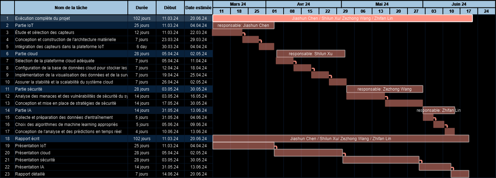

# Eau intelligent

## Introduction

Ce projet vise à utiliser la technologie de l'Internet des objets pour construire des étangs à poissons automatisés et intelligents, spécifiquement destinés à l'industrie de la pisciculture en réservoir. En automatisant la surveillance et la gestion des étangs, nous rendons le processus de pisciculture plus écologique, plus simple et plus intelligent.

**Membres**: Jiashun Chen/Shilun Xu/Zezhong Wang/Zhifan Lin

**Partage de documents**: [lien](https://docs.google.com/document/d/1ZcildPnoJ99VDRN4thcEPjKXmgYHPFyIxWTUTX1hytU/edit) 🚀

## Objectifs

Utiliser une technologie intelligente pour améliorer l’efficacité et la qualité de la reproduction, réduire les pertes liées aux maladies des pêches et le gaspillage des ressources des étangs à poissons.

## Fonctionnalités

1. **Détection de la santé des poissons** : utilisez des caméras sous-marines et une technologie d'analyse d'images pour surveiller le comportement des poissons et l'état de leur peau, détecter en temps opportun les alevins errants et malades, et fournir des diagnostics à distance et des suggestions de traitement grâce à une analyse logicielle.
2. **Détection et réglage de la qualité de l'eau** : à l'aide de dispositifs d'inspection automatique de l'eau, les paramètres de qualité de l'eau sont régulièrement surveillés, combinés à des dispositifs de réglage automatique, pour garantir que la qualité de l'eau est stabilisée au meilleur état et que l'environnement de croissance des poissons est garanti.
3. **Système d'alimentation intelligent** : grâce à des boîtes d'alimentation en libre-service, une alimentation personnalisée est réalisée en fonction de l'état de croissance et des caractéristiques individuelles des alevins, réduisant ainsi le gaspillage alimentaire et maintenant un modèle de pisciculture écologique.
4. **Surveillance à distance et analyse des données** : établissez une plate-forme de surveillance à distance pour surveiller les conditions des étangs à poissons en temps réel, collecter et analyser les données sur la qualité de l'eau et la santé des poissons, et fournir aux utilisateurs des rapports détaillés et une aide à la décision.

## Avantages

- **Système d'alerte précoce en temps réel** : il peut surveiller rapidement l'environnement de reproduction et l'état de santé des poissons, détecter les situations anormales et émettre des alarmes, aidant ainsi les pisciculteurs à prendre des mesures rapides pour réduire les risques et les pertes.
- **Efficacité élevée de l'utilisation des ressources** : grâce à la surveillance à distance et au contrôle automatisé de l'environnement, l'eau, les aliments pour animaux et l'énergie peuvent être utilisés plus efficacement, réduisant ainsi le gaspillage des ressources et les coûts de maintenance.
- **Amélioration de la qualité de la reproduction** : la surveillance en temps réel des paramètres environnementaux, de la qualité de l'eau et de l'état de santé des poissons permet aux pisciculteurs d'ajuster les stratégies de reproduction et de gestion en temps opportun pour améliorer les niveaux de reproduction et la qualité des produits.

## Utilisation

### Exigences matérielles

- Selon la taille de l'étang, le nombre de capteurs et leur type peut varier.
  - Pour un petit aire(moins de 1 000 m²), utilisez au moins 10 capteurs de qualité de l'eau (pH, oxygène dissous, température, etc.) avec un module de transmission de données IoT.
  - Pour un aire moyen (1 000 à 5 000 m²), doublez le nombre de capteurs pour garantir une couverture et une précision adéquates des données.
  - Pour les grands aire(plus de 5 000 m²), envisagez d'utiliser des capteurs supplémentaires et des drones aquatiques pour une surveillance étendue et précise.
- **Caméra haute définition** x 1 pour la consultation à distance.
- **Caméras de surveillance** x 3 pour le suivi en direct de l'étang.
- **Caméra sous-marine** 1 par 100 mètres carrés.
- **Téléphone et montre intelligents**, les agriculteurs peuvent vérifier toutes sortes de données et d'indicateurs à tout moment, contrôler à distance le nettoyage, la stérilisation et l'alimentation. Et avertir le propriétaire de l'étang dès qu'une situation d'urgence se présente.

### Exigences logicielles

Une application qui intègre tous les éléments ci-dessus et qui incorpore une intelligence artificielle complète et pré-entraînée.

### Protocoles de communication

- Zigbee: Dans l'aquaculture, Zigbee est utilisé pour connecter des capteurs légers et des dispositifs de surveillance tels que les capteurs de qualité de l'eau, de température, d'oxygène, etc. Ces dispositifs peuvent surveiller en temps réel les paramètres de l'eau et les transmettre à un système de contrôle central ou à un cloud pour analyse et traitement.
- WiFi : Le WiFi est généralement utilisé pour connecter des équipements plus volumineux et complexes tels que des caméras et des systèmes de surveillance vidéo. Dans l'aquaculture, les systèmes de surveillance vidéo peuvent utiliser le réseau WiFi pour transmettre en direct des flux vidéo, permettant de surveiller le comportement des poissons et les conditions des bassins, tout en transmettant d'autres données de surveillance détaillées.

### Gantt Chart

